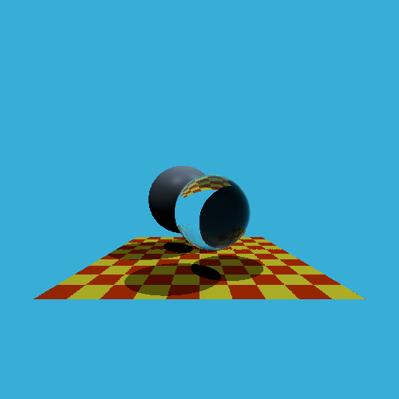

### A Whitted Style Ray Tracing Implement

伪代码：

```
function TraceRay(ray, depth):
    if depth > MaxDepth:
        return BlackColor

    Find the closest intersection point (P) and the intersected object (Obj) along the ray.
    if no intersection:
        return BackgroundColor

    Compute normal (N) at intersection point P.
    Compute material properties (Kd, Ks, Shininess, Kr, Kt, IoR) of Obj at P.

    // Ambient and Diffuse-Glossy component
    color = Obj.diffuse_color * AmbientLightColor
    for each light in scene:
        Construct shadow ray from P to light source.
        if shadow ray is not occluded:
            Calculate diffuse component: L_diff = max(0, dot_product(N, LightDirection)) * LightColor * Kd
            Calculate specular component: L_spec = pow(max(0, dot_product(ReflectedLightDirection, ViewDirection)), Shininess) * LightColor * Ks
            color = color + L_diff + L_spec

    // Reflection component
    if Obj has reflection properties (Kr > 0):
        reflection_direction = reflect(ray.direction, N)
        reflection_ray_origin = P + N * epsilon (or P - N * epsilon for inside objects)
        reflected_color = TraceRay(reflection_ray_origin, reflection_direction, depth + 1)
        color = color + reflected_color * Kr

    // Refraction component
    if Obj has refraction properties (Kt > 0):
        refraction_direction = refract(ray.direction, N, IoR)
        refraction_ray_origin = P - N * epsilon (or P + N * epsilon for inside objects)
        refracted_color = TraceRay(refraction_ray_origin, refraction_direction, depth + 1)
        color = color + refracted_color * Kt * (1 - FresnelFactor) // Fresnel factor for energy conservation

    return color

function RenderImage():
    for each pixel (x, y) in image:
        Construct primary ray from camera position through pixel (x, y).
        pixel_color = TraceRay(primary_ray, 0)
        Set pixel (x, y) to pixel_color


```

+ reflect(incident_direction, normal): 计算反射方向。

+ refract(incident_direction, normal, ior): 计算折射方向，其中 ior 是折射率。

+ fresnel(incident_direction, normal, ior): 计算菲涅尔项，用于确定反射和折射光的比例。

+ epsilon: 一个很小的偏移量，用于避免光线与物体自身相交产生的浮点精度问题。

result:

